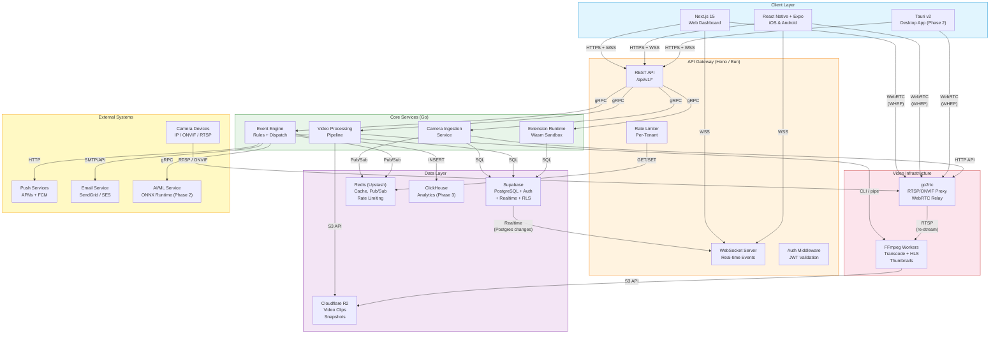
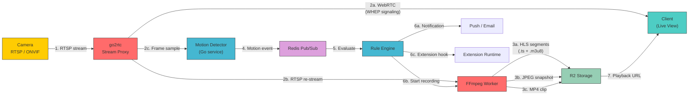
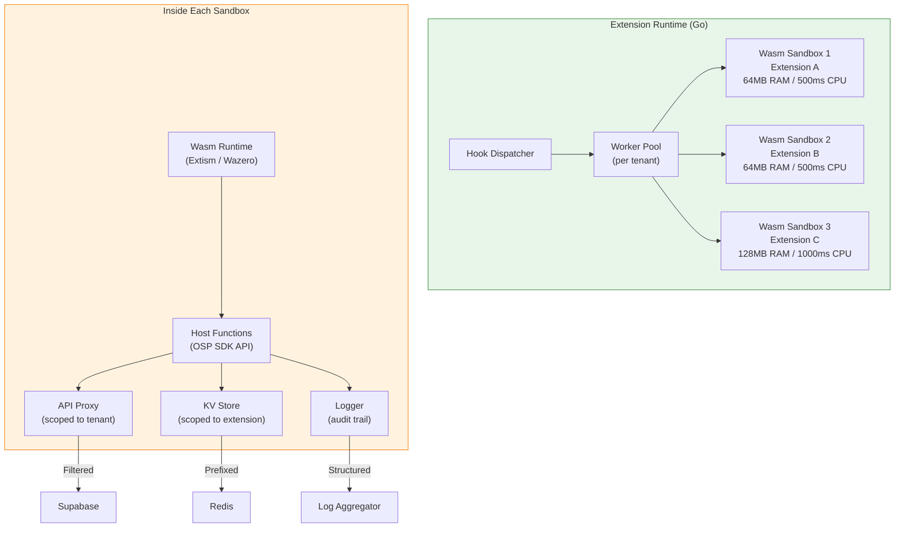
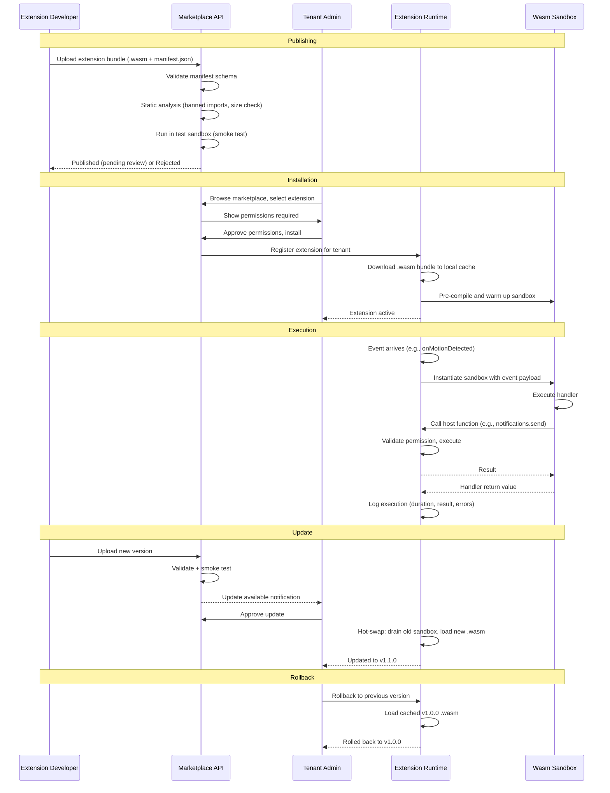
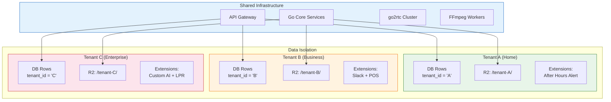
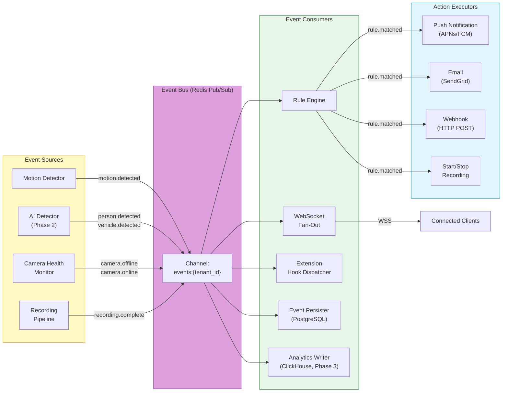
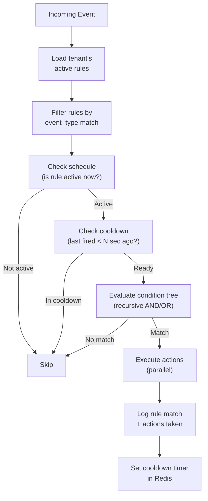
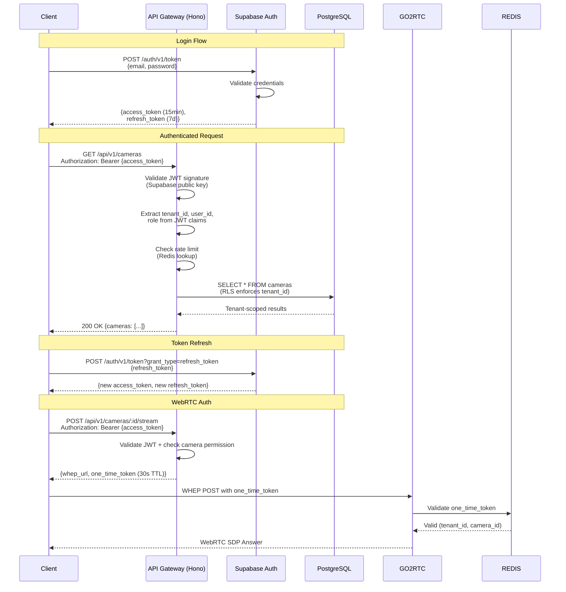
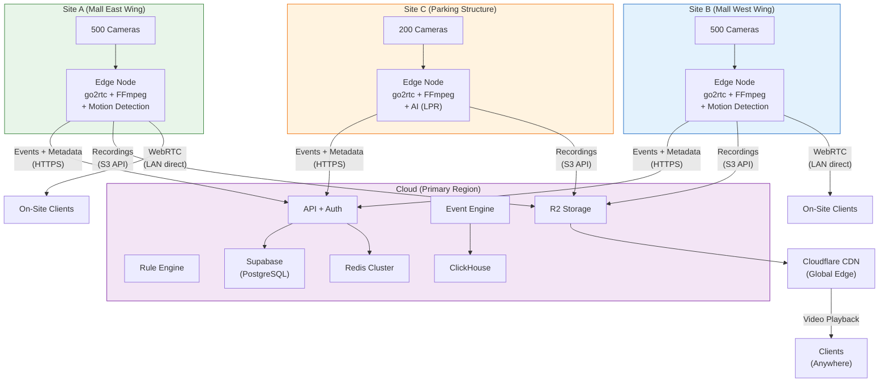

# Open Surveillance Platform (OSP) — System Architecture Document

**Version**: 1.0
**Date**: 2026-03-16
**Status**: Draft — Pending Review
**Depends on**: [PRD v1.0](./PRD.md) (Approved)

---

## Table of Contents

1. [High-Level Architecture Diagram](#1-high-level-architecture-diagram)
2. [Camera Ingestion Pipeline](#2-camera-ingestion-pipeline)
3. [Extension/Plugin Architecture](#3-extensionplugin-architecture)
4. [Multi-Tenancy Model](#4-multi-tenancy-model)
5. [Real-Time Event System](#5-real-time-event-system)
6. [Authentication & Authorization](#6-authentication--authorization)
7. [Trade-Off Analysis](#7-trade-off-analysis)
8. [Scaling Strategy](#8-scaling-strategy)

---

## 1. High-Level Architecture Diagram



### Connection Protocol Summary

| From | To | Protocol | Port | Purpose |
|------|-----|----------|------|---------|
| Clients | API Gateway | HTTPS (TLS 1.3) | 443 | REST API, auth |
| Clients | API Gateway | WSS | 443 | Real-time events |
| Clients | go2rtc | WebRTC (WHEP) | 8555 | Low-latency live view |
| API Gateway | Go Services | gRPC (TLS) | 50051–50054 | Service-to-service |
| Cameras | go2rtc | RTSP | 554 | Camera stream ingest |
| Cameras | go2rtc | ONVIF | 80/8080 | Discovery + PTZ |
| go2rtc | FFmpeg | RTSP (local) | — | Re-stream for processing |
| Go Services | Supabase | PostgreSQL | 5432 | Data persistence |
| Go Services | Redis | Redis protocol | 6379 | Cache, pub/sub |
| Go Services | R2 | S3 HTTPS | 443 | Object storage |
| Event Engine | Push Services | HTTP/2 | 443 | APNs, FCM |

---

## 2. Camera Ingestion Pipeline

This is the most complex and performance-critical subsystem. Every camera frame flows through this pipeline.

### 2.1 Pipeline Overview



### 2.2 Step-by-Step Detail

#### Step 1: Camera Connection & Discovery

| Aspect | Detail |
|--------|--------|
| **Service** | Camera Ingestion Service (Go) |
| **Protocol** | ONVIF WS-Discovery for auto-detection; RTSP for stream |
| **Flow** | User adds camera (manual URL or ONVIF scan) → Service validates connection → Registers stream in go2rtc via HTTP API → Stores camera metadata in PostgreSQL |
| **Failure mode** | Camera unreachable: retry with exponential backoff (1s, 2s, 4s, 8s, 16s, 30s cap). After 5 failures, mark camera `offline`, emit `camera.offline` event, notify user |
| **Recovery** | Background health checker pings every camera every 30s. On reconnect, emit `camera.online` event, resume all pipelines |
| **Scaling** | 1 camera: single goroutine. 10,000: connection pool with worker-per-camera, max 500 cameras per ingestion instance, horizontal scale via Kubernetes |

#### Step 2a: Live View (WebRTC)

| Aspect | Detail |
|--------|--------|
| **Service** | go2rtc (embedded WebRTC server) |
| **Protocol** | WHEP (WebRTC-HTTP Egress Protocol) for signaling; SRTP for media |
| **Flow** | Client sends WHEP offer → go2rtc responds with answer → Direct WebRTC media flow (no transcoding for live view) |
| **Latency** | <500ms LAN (direct RTSP → WebRTC passthrough), <2s remote (via TURN relay) |
| **Failure mode** | WebRTC ICE failure: fallback to HLS with 3–5s latency. go2rtc crash: supervisor restarts, client auto-reconnects |
| **Recovery** | Client-side reconnect with exponential backoff. go2rtc stateless — restart loses no data |
| **Scaling** | Each go2rtc instance handles ~200 concurrent WebRTC viewers. Scale horizontally behind load balancer with sticky sessions (ICE candidate affinity) |

#### Step 2b: Recording (FFmpeg)

| Aspect | Detail |
|--------|--------|
| **Service** | Video Processing Pipeline (Go) orchestrating FFmpeg workers |
| **Protocol** | RTSP from go2rtc → FFmpeg → S3 API to R2 |
| **Flow** | Motion event triggers recording → Go service spawns FFmpeg process → FFmpeg reads from go2rtc RTSP re-stream → Outputs HLS segments (.ts files, 2s each) + playlist (.m3u8) → Uploads to R2 at `/tenant-{id}/cameras/{cam-id}/{date}/` |
| **Pre-roll** | 30-second circular buffer in go2rtc RAM. On motion trigger, flush buffer to FFmpeg so recording starts 30s before the event |
| **Failure mode** | FFmpeg crash: Go service detects exit code, restarts FFmpeg, resumes from current stream position. Lost segments during crash (~2–4s gap). R2 upload failure: local disk spool, retry queue |
| **Recovery** | Incomplete recordings: write partial manifest. Mark recording as `partial` in DB. Retry upload from spool |
| **Scaling** | ~0.3 CPU core per 1080p transcode. 100 cameras = 30 cores dedicated to FFmpeg. Use separate compute pool for transcoding (Kubernetes node pool with CPU-optimized instances) |

#### Step 2c: Motion Detection

| Aspect | Detail |
|--------|--------|
| **Service** | Motion Detection (Go, part of Event Engine) |
| **Protocol** | Receives JPEG frames (1 fps sample from go2rtc) over internal pipe |
| **Flow** | go2rtc outputs 1 frame/sec per camera → Motion detector computes frame diff → Applies zone mask (ignore regions outside defined zones) → If pixel-change exceeds threshold → Emit `motion.detected` event to Redis pub/sub |
| **Algorithm** | Frame differencing (current vs previous) → Gaussian blur (reduce noise) → Threshold (configurable 1–10) → Contour detection (size filter) → Zone intersection check |
| **Failure mode** | Detector falls behind: drop frames (best-effort, skip to latest). High CPU: reduce sample rate to 0.5 fps per camera |
| **Scaling** | ~0.05 CPU core per camera at 1 fps. 1,000 cameras = 50 cores. Partition cameras across detector instances by tenant/camera-id hash |

#### Step 3: Storage & Indexing

| Aspect | Detail |
|--------|--------|
| **Service** | Video Processing Pipeline (Go) |
| **Storage layout** | `/tenant-{id}/videos/camera-{id}/YYYY/MM/DD/HH-MM-SS/` containing `.ts` segments + `.m3u8` playlist |
| **Thumbnails** | FFmpeg extracts 1 JPEG per event at moment of peak motion. Stored at `/tenant-{id}/snapshots/event-{id}.jpg` |
| **Indexing** | Recording metadata written to PostgreSQL: `recordings` table with `camera_id`, `start_time`, `end_time`, `storage_path`, `trigger`, `size_bytes` |
| **Retention** | Background Go worker runs daily per tenant. Deletes recordings older than tenant's retention limit. Deletes R2 objects and DB rows in batch |
| **Failure mode** | R2 unavailable: buffer to local disk (max 10GB spool per instance). Alert if spool >80% full. Retry uploads on R2 recovery |
| **Scaling** | Storage is the primary cost driver. At 1080p motion-triggered: ~5GB/camera/day. 1,000 cameras × 30 days = 150TB. R2 at $0.015/GB/month = ~$2,250/month storage |

### 2.3 Pipeline Performance Budget

| Stage | Latency Budget | Measured At |
|-------|---------------|-------------|
| Camera → go2rtc (RTSP connect) | <1s | First RTSP frame received |
| go2rtc → Client (WebRTC) | <500ms | First video frame rendered |
| go2rtc → FFmpeg (recording start) | <200ms | FFmpeg receives first frame after trigger |
| Motion detection (frame analysis) | <100ms per frame | Event emitted after threshold exceeded |
| Event → Rule evaluation | <50ms | Rule engine returns action list |
| Rule → Push notification | <2s | APNs/FCM delivery |
| **Total: Motion → User notified** | **<3s** | End-to-end |

---

## 3. Extension/Plugin Architecture

### 3.1 Extension Manifest

Every extension declares its capabilities and requirements in a manifest:

```json
{
  "id": "com.example.after-hours-alert",
  "name": "After Hours Alert",
  "version": "1.0.0",
  "description": "Send Slack alerts for after-hours motion",
  "author": {
    "name": "Example Corp",
    "email": "dev@example.com",
    "url": "https://example.com"
  },
  "engine": "osp-sdk@^1.0.0",
  "entrypoint": "dist/index.js",

  "hooks": [
    {
      "event": "onMotionDetected",
      "handler": "handleMotion",
      "priority": 100
    }
  ],

  "widgets": [
    {
      "id": "after-hours-summary",
      "name": "After Hours Summary",
      "component": "dist/widgets/Summary.js",
      "placement": ["dashboard", "camera-detail"],
      "size": { "minWidth": 2, "minHeight": 1 }
    }
  ],

  "permissions": [
    "cameras:read",
    "events:read",
    "notifications:send",
    "storage:read_write"
  ],

  "config": {
    "schema": {
      "slackWebhookUrl": { "type": "string", "required": true, "secret": true },
      "startHour": { "type": "number", "default": 22, "min": 0, "max": 23 },
      "endHour": { "type": "number", "default": 6, "min": 0, "max": 23 }
    }
  },

  "resources": {
    "maxMemoryMb": 64,
    "maxCpuMs": 500,
    "maxApiCallsPerMinute": 60,
    "maxStorageBytes": 10485760
  }
}
```

### 3.2 Hook System

#### Available Hook Points

| Hook | Trigger | Payload Shape | Phase |
|------|---------|--------------|-------|
| `onMotionDetected` | Motion exceeds threshold in any zone | `{ cameraId, zones[], intensity, snapshotUrl, timestamp }` | 1 (SDK Phase 2) |
| `onPersonDetected` | AI identifies a person | `{ cameraId, boundingBox, confidence, snapshotUrl, timestamp }` | 2 |
| `onVehicleDetected` | AI identifies a vehicle | `{ cameraId, boundingBox, confidence, plateNumber?, timestamp }` | 2 |
| `onCameraOffline` | Camera unreachable for >60s | `{ cameraId, lastSeenAt, failureReason }` | 1 |
| `onCameraOnline` | Camera reconnected | `{ cameraId, downtime_seconds }` | 1 |
| `onRecordingComplete` | Recording segment finalized | `{ cameraId, recordingId, duration, storageUrl, trigger }` | 1 |
| `onAlertTriggered` | Rule engine fires an alert | `{ ruleId, ruleName, cameraId, eventType, actions[] }` | 2 |
| `onScheduledTick` | Cron-like scheduled invocation | `{ extensionId, schedule, tickNumber }` | 2 |

#### Execution Order

1. Events arrive on Redis pub/sub channel `events:{tenant_id}`
2. Extension Runtime loads all enabled extensions for the tenant
3. Extensions sorted by `priority` (lower = earlier, default 100)
4. Each extension's handler called sequentially within priority tier
5. Extensions at the same priority run concurrently
6. Any extension can return `{ abort: true }` to stop the chain (requires `events:abort` permission)
7. Total execution timeout: 5s per hook invocation across all extensions

#### Payload Envelope

```json
{
  "hookId": "hook_abc123",
  "event": "onMotionDetected",
  "timestamp": "2026-03-16T12:00:00.000Z",
  "tenantId": "tenant_xyz",
  "data": {
    "cameraId": "cam_456",
    "zones": ["front-door"],
    "intensity": 0.78,
    "snapshotUrl": "https://r2.example.com/tenant_xyz/snapshots/evt_789.jpg",
    "timestamp": "2026-03-16T12:00:00.000Z"
  },
  "context": {
    "camera": { "id": "cam_456", "name": "Front Door", "location": "entrance" },
    "tenant": { "id": "tenant_xyz", "plan": "pro" }
  }
}
```

### 3.3 Isolation & Sandboxing



#### Isolation Guarantees

| Threat | Mitigation |
|--------|-----------|
| Extension consumes all CPU | Wasm fuel metering: each extension gets CPU budget per invocation (default 500ms wall-clock). Exceeded → killed, event logged |
| Extension consumes all memory | Wasm linear memory capped at manifest's `maxMemoryMb` (default 64MB). OOM → killed |
| Extension makes excessive API calls | Host function rate limiter: `maxApiCallsPerMinute` per extension. Exceeded → calls rejected with error |
| Extension accesses other tenant's data | All host functions prepend `tenant_id` to queries/keys. No raw SQL access. RLS as second defense layer |
| Extension crashes | Wasm trap caught by host. Extension marked `errored`. Other extensions continue. Alert sent to extension author |
| Extension runs forever | 5s total timeout per hook chain. Individual extension timeout: 2s default. Killed on timeout |
| Malicious extension (data exfiltration) | Network access only through host functions (no raw sockets). Outbound HTTP allowlisted to extension-declared domains. All calls logged |

### 3.4 Extension Lifecycle



### 3.5 Extension Marketplace

| Feature | Detail |
|---------|--------|
| **Discovery** | Browse by category (alerts, analytics, integrations, AI), search by name/keyword, sort by installs/rating |
| **Install** | One-click install with permission approval modal. Tenant admin only |
| **Configuration** | Per-tenant config (e.g., Slack webhook URL) stored encrypted in PostgreSQL. Schema-driven settings UI auto-generated from manifest |
| **Update** | Semantic versioning. Minor/patch auto-update optional. Major requires explicit approval |
| **Rollback** | Last 3 versions cached. One-click rollback in settings |
| **Uninstall** | Removes extension, deletes KV data, revokes permissions. Recordings/events created by extension persist |
| **Rating & Reviews** | 1–5 stars, written reviews. Verified installs only |
| **Revenue** | Phase 3: 70/30 revenue split (developer/OSP) for paid extensions |

---

## 4. Multi-Tenancy Model

### 4.1 Architecture Overview



### 4.2 Supabase RLS Policies

Every table that stores tenant data has these policies:

```sql
-- Base policy: tenant can only see their own rows
ALTER TABLE cameras ENABLE ROW LEVEL SECURITY;

CREATE POLICY "tenant_select" ON cameras
  FOR SELECT USING (
    tenant_id = (auth.jwt() ->> 'tenant_id')::uuid
  );

CREATE POLICY "tenant_insert" ON cameras
  FOR INSERT WITH CHECK (
    tenant_id = (auth.jwt() ->> 'tenant_id')::uuid
  );

CREATE POLICY "tenant_update" ON cameras
  FOR UPDATE USING (
    tenant_id = (auth.jwt() ->> 'tenant_id')::uuid
  ) WITH CHECK (
    tenant_id = (auth.jwt() ->> 'tenant_id')::uuid
  );

CREATE POLICY "tenant_delete" ON cameras
  FOR DELETE USING (
    tenant_id = (auth.jwt() ->> 'tenant_id')::uuid
    AND EXISTS (
      SELECT 1 FROM user_roles
      WHERE user_roles.user_id = auth.uid()
      AND user_roles.tenant_id = cameras.tenant_id
      AND user_roles.role IN ('owner', 'admin')
    )
  );
```

**Camera-scoped viewer policy** (Viewer can only see assigned cameras):

```sql
CREATE POLICY "viewer_camera_select" ON cameras
  FOR SELECT USING (
    tenant_id = (auth.jwt() ->> 'tenant_id')::uuid
    AND (
      -- Admins/operators see all cameras
      EXISTS (
        SELECT 1 FROM user_roles
        WHERE user_id = auth.uid()
        AND tenant_id = cameras.tenant_id
        AND role IN ('owner', 'admin', 'operator')
      )
      OR
      -- Viewers see only assigned cameras
      EXISTS (
        SELECT 1 FROM user_roles
        WHERE user_id = auth.uid()
        AND tenant_id = cameras.tenant_id
        AND role = 'viewer'
        AND cameras.id = ANY(camera_ids)
      )
    )
  );
```

### 4.3 Storage Isolation

| Layer | Isolation Mechanism |
|-------|-------------------|
| **PostgreSQL** | `tenant_id` column on every table + RLS policies. No cross-tenant JOINs possible |
| **R2 Object Storage** | Key prefix: `/tenant-{id}/`. Service generates pre-signed URLs scoped to prefix. No listing across prefixes |
| **Redis** | Key prefix: `t:{tenant_id}:`. All cache/pubsub operations scoped. Pub/sub channels: `events:{tenant_id}` |
| **Extension KV** | Key prefix: `ext:{tenant_id}:{extension_id}:`. Double-scoped to prevent cross-extension leaks |
| **ClickHouse (Phase 3)** | `tenant_id` column with query-time filter. Materialized views per tenant for heavy analytics |

### 4.4 Rate Limiting Per Tenant/Plan

| Resource | Free | Pro | Business | Enterprise |
|----------|------|-----|----------|------------|
| API requests/min | 60 | 300 | 1,000 | 5,000 |
| WebSocket connections | 2 | 5 | 25 | 100 |
| Concurrent streams | 2 | 4 | 8 | 16 |
| Extension API calls/min | 10 | 60 | 300 | 1,000 |
| Recording hours/day | 2 | 12 | Unlimited | Unlimited |
| ONVIF discovery scans/hour | 5 | 10 | 30 | 60 |

Rate limits enforced at API Gateway using Redis sliding window counter:
- Key: `rate:{tenant_id}:{endpoint}:{window}`
- Window: 60-second sliding window
- Response: `429 Too Many Requests` with `Retry-After` header

---

## 5. Real-Time Event System

### 5.1 Event-Driven Architecture



### 5.2 Event Schema

```json
{
  "id": "evt_01HZ8XJQK4MVBN3S2RTYP6WDFC",
  "type": "motion.detected",
  "version": "1.0",
  "tenant_id": "tenant_xyz",
  "camera_id": "cam_456",
  "timestamp": "2026-03-16T22:15:03.421Z",
  "severity": "medium",
  "data": {
    "zones": ["front-door", "porch"],
    "intensity": 0.78,
    "bounding_boxes": [
      { "x": 120, "y": 80, "width": 200, "height": 400 }
    ],
    "snapshot_url": "/tenant_xyz/snapshots/evt_01HZ8X.jpg"
  },
  "metadata": {
    "source_service": "motion-detector",
    "processing_time_ms": 45,
    "camera_name": "Front Door Cam",
    "camera_location": { "lat": 37.7749, "lng": -122.4194 }
  }
}
```

#### Event Types

| Type | Severity Default | Data Fields |
|------|-----------------|-------------|
| `motion.detected` | medium | zones[], intensity, bounding_boxes[], snapshot_url |
| `person.detected` | high | confidence, bounding_box, snapshot_url, tracking_id |
| `vehicle.detected` | medium | confidence, bounding_box, plate_number?, snapshot_url |
| `camera.offline` | critical | last_seen_at, failure_reason, retry_count |
| `camera.online` | low | downtime_seconds, reconnect_method |
| `recording.complete` | low | recording_id, duration_sec, storage_url, trigger, size_bytes |
| `rule.matched` | varies (from rule) | rule_id, rule_name, matched_conditions[], actions_taken[] |

### 5.3 Rule Evaluation Engine

Rules are stored as JSON condition trees and evaluated in the Event Engine (Go).

#### Rule Structure

```json
{
  "id": "rule_789",
  "name": "After Hours Storage Room",
  "enabled": true,
  "trigger": {
    "event_type": "motion.detected"
  },
  "conditions": {
    "operator": "AND",
    "children": [
      {
        "field": "data.zones",
        "operator": "contains",
        "value": "storage-room"
      },
      {
        "operator": "OR",
        "children": [
          {
            "field": "metadata.timestamp.hour",
            "operator": "gte",
            "value": 21
          },
          {
            "field": "metadata.timestamp.hour",
            "operator": "lte",
            "value": 6
          }
        ]
      },
      {
        "field": "data.intensity",
        "operator": "gte",
        "value": 0.3
      }
    ]
  },
  "actions": [
    {
      "type": "push_notification",
      "config": {
        "title": "After-Hours Alert",
        "body": "Motion detected in storage room at {{camera_name}}",
        "priority": "high"
      }
    },
    {
      "type": "start_recording",
      "config": {
        "duration_sec": 300,
        "quality": "high"
      }
    },
    {
      "type": "webhook",
      "config": {
        "url": "https://hooks.slack.com/xxx",
        "method": "POST"
      }
    }
  ],
  "cooldown_sec": 60,
  "schedule": {
    "timezone": "America/Chicago",
    "active_periods": [
      { "days": ["mon","tue","wed","thu","fri"], "start": "21:00", "end": "06:00" }
    ]
  }
}
```

#### Evaluation Flow



Rule conditions compiled to Go evaluation functions on rule creation/update and cached in memory per tenant. Hot-reloaded on rule change via Redis pub/sub notification.

---

## 6. Authentication & Authorization

### 6.1 Auth Providers

| Provider | Phase | Use Case |
|----------|-------|----------|
| Email/Password | 1 | Default signup |
| Google OAuth | 1 | Quick signup/login |
| Apple Sign-In | 1 | iOS requirement |
| GitHub OAuth | 2 | Developer-focused extensions |
| SAML/SSO | 3 | Enterprise IdP integration |

All handled by Supabase Auth. OSP does not store passwords.

### 6.2 JWT Token Flow



### 6.3 Custom JWT Claims

Supabase JWT extended with OSP-specific claims via database hook:

```json
{
  "sub": "user_123",
  "email": "sarah@example.com",
  "tenant_id": "tenant_xyz",
  "role": "admin",
  "camera_ids": null,
  "plan": "pro",
  "iat": 1710619200,
  "exp": 1710620100
}
```

- `tenant_id`: primary isolation key, used by RLS
- `role`: RBAC role within tenant
- `camera_ids`: null for owner/admin/operator (access all), array for viewer (scoped)
- `plan`: tenant plan tier (used for feature gating at API level)

### 6.4 RBAC Permission Matrix

| Action | Owner | Admin | Operator | Viewer |
|--------|-------|-------|----------|--------|
| **Cameras: Add/Remove** | Yes | Yes | No | No |
| **Cameras: Edit Config** | Yes | Yes | No | No |
| **Cameras: View (All)** | Yes | Yes | Yes | No |
| **Cameras: View (Assigned)** | Yes | Yes | Yes | Yes |
| **Cameras: PTZ Control** | Yes | Yes | Yes | No |
| **Live View** | Yes | Yes | Yes | Scoped |
| **Playback / Timeline** | Yes | Yes | Yes | Scoped |
| **Clip Export** | Yes | Yes | Yes | No |
| **Events: View** | Yes | Yes | Yes | Scoped |
| **Events: Acknowledge** | Yes | Yes | Yes | No |
| **Rules: Create/Edit** | Yes | Yes | No | No |
| **Rules: View** | Yes | Yes | Yes | No |
| **Users: Invite** | Yes | Yes | No | No |
| **Users: Remove** | Yes | Yes (not owner) | No | No |
| **Users: Change Roles** | Yes | No | No | No |
| **Extensions: Install/Remove** | Yes | Yes | No | No |
| **Extensions: Configure** | Yes | Yes | No | No |
| **Billing / Plan** | Yes | No | No | No |
| **Tenant Settings** | Yes | Yes | No | No |
| **Audit Logs** | Yes | Yes | No | No |

### 6.5 Per-Camera and Per-Zone Permissions

**Camera-level**: Viewer role has `camera_ids[]` array. Only cameras in this list are visible/accessible. RLS policy enforces this.

**Zone-level** (Phase 2): Each camera's zones can have visibility flags:

```json
{
  "zones": [
    { "id": "zone_1", "name": "front-door", "visible_to_roles": ["owner", "admin", "operator", "viewer"] },
    { "id": "zone_2", "name": "register", "visible_to_roles": ["owner", "admin"] },
    { "id": "zone_3", "name": "safe-room", "visible_to_roles": ["owner"] }
  ]
}
```

Zone permissions filter which motion events and alerts a user receives. The video stream itself is full-frame (zone masking for privacy is a Phase 3 feature using FFmpeg overlay).

### 6.6 API Keys for Extension Developers

| Feature | Detail |
|---------|--------|
| **Key format** | `osp_ext_{env}_{random32}` (e.g., `osp_ext_prod_a1b2c3d4...`) |
| **Scopes** | `marketplace:publish`, `marketplace:read`, `extensions:test` |
| **Rate limit** | 100 req/min for marketplace API, 10 req/min for test sandbox |
| **Rotation** | Keys expire after 90 days. Warning email at 14 days before expiry |
| **Revocation** | Immediate revocation via developer portal or admin API |
| **Storage** | Hashed (SHA-256) in PostgreSQL. Raw key shown once on creation |

---

## 7. Trade-Off Analysis

### 7.1 Go vs Rust for Video Services

| Aspect | Go (Chosen) | Rust (Rejected) |
|--------|------------|-----------------|
| **Concurrency model** | Goroutines (lightweight, millions of concurrent tasks) | async/await with Tokio (powerful but steeper learning curve) |
| **FFmpeg integration** | Shells out to FFmpeg CLI or uses CGo bindings | Rust FFmpeg bindings (less mature, unsafe blocks) |
| **Ecosystem for video** | go2rtc, Pion WebRTC, well-tested in production | webrtc-rs exists but less battle-tested at scale |
| **Developer hiring** | Large Go talent pool in infrastructure/video space | Smaller pool, higher cost |
| **Build time** | Fast (~5s incremental) | Slow (minutes for full build) |
| **Memory safety** | GC handles most issues; goroutine leaks possible | Compile-time guarantees; zero runtime overhead |
| **Performance** | ~80% of Rust for stream handling (sufficient) | Maximum throughput, zero-copy |

**Decision**: Go. The video pipeline shells out to FFmpeg (the real performance work), so Go vs Rust in the orchestration layer is not the bottleneck. Go's goroutine model is ideal for managing thousands of concurrent camera connections. Pion (Go WebRTC) and go2rtc are production-proven.

**Reconsider when**: We need to run on extremely resource-constrained edge devices (Raspberry Pi Zero), or if FFmpeg integration moves in-process for zero-copy frame processing.

---

### 7.2 Supabase vs Self-Hosted PostgreSQL

| Aspect | Supabase (Chosen) | Self-Hosted Postgres (Rejected) |
|--------|-------------------|--------------------------------|
| **Auth** | Built-in (email, OAuth, SSO). No custom auth service needed | Must build/integrate auth separately (Keycloak, Auth0) |
| **RLS** | First-class support, tested at scale | Same PostgreSQL RLS, but must configure and test ourselves |
| **Realtime** | Built-in change data capture → WebSocket | Must add Debezium + custom WebSocket layer |
| **Storage** | Supabase Storage with policies | Must integrate S3 separately (but we use R2 anyway) |
| **Ops** | Managed: backups, scaling, monitoring, upgrades | Full ops burden: HA, replication, backups, security patches |
| **Cost** | Free tier → $25/mo Pro → custom Enterprise | $50–200/mo for equivalent managed Postgres (RDS, etc.) |
| **Vendor lock-in** | Moderate — Supabase is open source, can self-host | None |
| **Edge cases** | Some limitations on custom Postgres extensions | Full control |

**Decision**: Supabase. The built-in auth + RLS + realtime eliminates 3 separate services we'd otherwise build. For MVP, the productivity gain outweighs the mild vendor coupling. Supabase is open-source, so we can self-host if needed.

**Reconsider when**: We need Postgres extensions not supported by Supabase (e.g., TimescaleDB for time-series), or when enterprise clients require fully self-hosted deployment with no third-party dependencies.

---

### 7.3 go2rtc vs MediaMTX

| Aspect | go2rtc (Chosen) | MediaMTX (Rejected) |
|--------|----------------|---------------------|
| **Protocol support** | RTSP, ONVIF, WebRTC, HomeKit, MPEG-DASH, HLS | RTSP, WebRTC, HLS, RTMP, SRT |
| **Camera compat** | Excellent — handles quirky cameras gracefully (Wyze, Tapo, Reolink) | Good for standard RTSP, less forgiving with non-standard implementations |
| **WebRTC** | Native WHEP/WHIP support, zero-config | WebRTC support exists but less mature |
| **API** | HTTP API for dynamic stream management (add/remove at runtime) | Config-file based, restart for changes (dynamic API added recently) |
| **Resource usage** | ~5MB RAM per idle stream, ~20MB active | ~10MB RAM per stream |
| **Community** | Active (go2rtc used by Frigate, Home Assistant) | Active (formerly rtsp-simple-server) |
| **Pre-roll buffer** | Built-in circular buffer support | No native pre-roll |

**Decision**: go2rtc. Superior camera compatibility, runtime API for dynamic stream management (critical for multi-tenant), built-in pre-roll buffer, and proven at scale in Frigate NVR with thousands of users.

**Reconsider when**: We need RTMP ingest (streaming sources), SRT support, or if MediaMTX's dynamic API matures and camera compat catches up.

---

### 7.4 WebRTC vs HLS for Live View

| Aspect | WebRTC (Chosen for live) | HLS (Used for playback only) |
|--------|--------------------------|------------------------------|
| **Latency** | <500ms (real-time) | 3–15s (segment-based) |
| **Browser support** | All modern browsers | All modern browsers |
| **Scaling** | Per-connection (STUN/TURN needed) | CDN-friendly (static files) |
| **NAT traversal** | Requires STUN/TURN server | Works anywhere (HTTP) |
| **Two-way audio** | Native (bidirectional) | One-way only |
| **Battery (mobile)** | Higher (always-on connection) | Lower (buffered playback) |

**Decision**: WebRTC for live view (latency is non-negotiable for surveillance), HLS for recorded playback (CDN-friendly, efficient, seek-friendly). Fallback: if WebRTC fails (restrictive firewall), degrade to Low-Latency HLS (~2s).

**Reconsider when**: LL-HLS achieves sub-1s latency reliably, which would simplify the stack by removing WebRTC entirely.

---

### 7.5 Monorepo vs Polyrepo

| Aspect | Monorepo (Chosen) | Polyrepo (Rejected) |
|--------|-------------------|---------------------|
| **Shared code** | Single source of truth for types, API contracts, shared utils | Must publish packages, version separately |
| **Atomic changes** | One PR updates API + web + mobile + types | Multi-repo coordination, version skew risk |
| **CI/CD** | One pipeline (with path-based triggers) | Separate pipelines, inter-repo triggers |
| **Developer experience** | Single clone, one workspace, shared tooling | Context-switching between repos |
| **Scaling** | Can become slow with many teams (mitigated by Turborepo/Nx) | Clean boundaries, independent deploy |

**Decision**: Monorepo (Turborepo). The shared TypeScript package between web/mobile/API is the strongest argument — type changes propagate instantly. Team size (<10 devs) makes monorepo overhead negligible.

**Structure**:
```
osp/
├── apps/
│   ├── web/          (Next.js)
│   ├── mobile/       (React Native / Expo)
│   ├── desktop/      (Tauri, Phase 2)
│   └── api/          (Hono / Bun)
├── packages/
│   ├── shared/       (types, API client, validation schemas)
│   ├── ui/           (shared React components)
│   └── extension-sdk/ (Extension SDK)
├── services/
│   ├── camera-ingestion/  (Go)
│   ├── video-pipeline/    (Go)
│   ├── event-engine/      (Go)
│   └── extension-runtime/ (Go)
├── infra/
│   ├── docker-compose.yml
│   ├── kubernetes/
│   └── supabase/
└── turbo.json
```

**Reconsider when**: Team grows beyond 20 developers or Go services need completely independent release cycles.

---

### 7.6 Cloudflare R2 vs AWS S3

| Aspect | Cloudflare R2 (Chosen) | AWS S3 (Rejected) |
|--------|------------------------|---------------------|
| **Egress cost** | $0 (zero egress fees) | $0.09/GB (adds up fast for video) |
| **Storage cost** | $0.015/GB/month | $0.023/GB/month (Standard) |
| **S3 compatibility** | Full S3 API compatible | Native |
| **CDN integration** | Native Cloudflare CDN | Requires CloudFront setup |
| **Multi-region** | Automatic (Cloudflare edge) | Must configure cross-region replication |
| **Ecosystem** | Growing | Massive (Lambda triggers, etc.) |

**Decision**: R2. Video serving is egress-heavy — a 1,000-camera system serving 50TB/month of playback would cost $4,500/month in S3 egress vs $0 on R2. The S3 API compatibility means zero code changes if we switch later.

**Cost example (1,000 cameras, 30d retention)**:
- Storage: 150TB × $0.015 = $2,250/mo (R2) vs $3,450/mo (S3)
- Egress (50TB playback): $0 (R2) vs $4,500/mo (S3)
- **Total: $2,250/mo (R2) vs $7,950/mo (S3)**

**Reconsider when**: We need S3 event triggers (Lambda on upload), or AWS-specific features like S3 Intelligent Tiering or Glacier integration for cold storage archival.

---

## 8. Scaling Strategy

### 8.1 Scale Tiers

```mermaid
graph TB
    subgraph Tier1 ["Tier 1: 1–50 cameras<br/>Single Server"]
        T1_APP["All-in-One<br/>Docker Compose"]
        T1_GO2RTC["go2rtc"]
        T1_FFMPEG["FFmpeg"]
        T1_API["API Gateway"]
        T1_SERVICES["Go Services"]
        T1_DB["Supabase (hosted)"]
        T1_R2["R2 Storage"]
    end

    subgraph Tier2 ["Tier 2: 50–500 cameras<br/>Horizontal Scaling"]
        T2_LB["Load Balancer<br/>(Cloudflare)"]
        T2_API1["API x2"]
        T2_API2["API x2"]
        T2_GO2RTC1["go2rtc x2"]
        T2_GO2RTC2["go2rtc x2"]
        T2_FF1["FFmpeg Pool<br/>(4 workers)"]
        T2_SERVICES1["Go Services x2"]
        T2_DB["Supabase Pro"]
        T2_REDIS["Redis Cluster"]
        T2_R2["R2 Storage"]
    end

    subgraph Tier3 ["Tier 3: 500–5,000 cameras<br/>Kubernetes"]
        T3_INGRESS["K8s Ingress<br/>(Cloudflare Tunnel)"]
        T3_API["API Pods<br/>(auto-scale 2–10)"]
        T3_GO2RTC["go2rtc Pods<br/>(auto-scale 3–20)"]
        T3_FF["FFmpeg Pod Pool<br/>(auto-scale 5–50)"]
        T3_EVENT["Event Engine Pods<br/>(auto-scale 2–8)"]
        T3_EXT["Extension Runtime<br/>(auto-scale 2–6)"]
        T3_DB["Supabase Enterprise<br/>(dedicated, read replicas)"]
        T3_REDIS["Redis Cluster<br/>(3-node)"]
        T3_R2["R2 (multi-region)"]
        T3_CH["ClickHouse Cloud"]
    end

    subgraph Tier4 ["Tier 4: 5,000–10,000+ cameras<br/>Edge + Regional"]
        T4_EDGE1["Edge Node<br/>Site A<br/>(go2rtc + FFmpeg)"]
        T4_EDGE2["Edge Node<br/>Site B<br/>(go2rtc + FFmpeg)"]
        T4_EDGE3["Edge Node<br/>Site C<br/>(go2rtc + FFmpeg)"]
        T4_CLOUD["Cloud Region<br/>(API + Events + Storage)"]
        T4_CDN["Cloudflare CDN<br/>(global)"]
    end

    Tier1 -.->|"Growth"| Tier2
    Tier2 -.->|"Growth"| Tier3
    Tier3 -.->|"Growth"| Tier4

    style Tier1 fill:#e8f5e9,stroke:#2e7d32
    style Tier2 fill:#e3f2fd,stroke:#1565c0
    style Tier3 fill:#fff3e0,stroke:#ef6c00
    style Tier4 fill:#fce4ec,stroke:#c62828
```



### 8.2 Tier 1: Single Server (1–50 cameras)

**Target**: Home users, small businesses, self-hosters

| Component | Deployment | Resources |
|-----------|-----------|-----------|
| API Gateway (Hono/Bun) | Docker container | 1 CPU, 512MB RAM |
| Go Services (all-in-one) | Docker container | 2 CPU, 1GB RAM |
| go2rtc | Docker container | 2 CPU, 1GB RAM |
| FFmpeg workers | Spawned by Go service | ~0.3 CPU per active camera |
| Supabase | Hosted (cloud) | Free/Pro tier |
| Redis | Embedded (KeyDB) or Upstash | 256MB RAM |
| R2 | Cloudflare hosted | Pay-per-use |

**Hardware minimum**: 4-core CPU, 4GB RAM, 100Mbps network
**Estimated cost**: $5–25/month (cloud) or free (self-hosted on existing hardware)
**Docker Compose**: Single `docker-compose.yml` starts everything

### 8.3 Tier 2: Horizontal Scaling (50–500 cameras)

**Target**: Growing businesses, small retail chains

| Change from Tier 1 | Why |
|-------------------|-----|
| API Gateway → 2 instances behind load balancer | Handle more concurrent API + WebSocket connections |
| go2rtc → 2 instances | Each handles ~200 cameras. Cameras partitioned by hash |
| FFmpeg → dedicated worker pool (4 workers) | Separate compute for transcoding from stream relay |
| Redis → dedicated instance (Upstash Pro) | Pub/sub throughput, rate limiting at scale |
| Supabase → Pro plan | Connection pooling, more storage, point-in-time recovery |

**Key scaling trigger**: Single go2rtc instance CPU consistently >70%, or API response time degrades past 200ms p95.

**Camera assignment**: Consistent hashing of `camera_id` to go2rtc instance. On instance add/remove, only ~1/N cameras rebalance. Managed by Camera Ingestion Service.

**Estimated cost**: $100–300/month

### 8.4 Tier 3: Kubernetes (500–5,000 cameras)

**Target**: Retail chains, mid-size enterprises

| Component | Scaling Policy | Min–Max Pods |
|-----------|---------------|--------------|
| API Gateway | CPU >60% → scale up | 2–10 |
| go2rtc | cameras/pod >200 → scale up | 3–20 |
| FFmpeg workers | active-transcodes/pod >10 → scale up | 5–50 |
| Event Engine | events/sec >500 → scale up | 2–8 |
| Extension Runtime | hook-invocations/min >1000 → scale up | 2–6 |

**Additional infrastructure**:
- **Supabase Enterprise**: Dedicated instance, read replicas for heavy query load (event search, analytics)
- **Redis Cluster**: 3-node cluster for HA pub/sub, rate limiting state replication
- **ClickHouse Cloud**: Analytics queries offloaded from PostgreSQL (event aggregation, heatmaps)
- **Cloudflare Tunnel**: Secure ingress without public IPs

**Key decisions at this tier**:
- go2rtc instances become stateful (camera assignments). Use Kubernetes StatefulSet with headless service
- FFmpeg workers are stateless — use Kubernetes Deployment with HPA
- Event Engine partitioned by tenant_id hash for ordered processing within a tenant

**Estimated cost**: $500–3,000/month

### 8.5 Tier 4: Edge + Regional (5,000–10,000+ cameras)

**Target**: Malls, large enterprises, multi-site deployments



#### Edge Node Specification

| Component | Purpose | Resources |
|-----------|---------|-----------|
| **go2rtc** | Camera connection, WebRTC relay for LAN viewers | 4 CPU, 4GB RAM |
| **FFmpeg workers** | Local transcoding + HLS packaging | 8 CPU, 4GB RAM |
| **Motion Detector** | Frame analysis, event generation | 2 CPU, 1GB RAM |
| **AI Runtime** (optional) | On-site ONNX inference (person detection, LPR) | 4 CPU + GPU optional, 4GB RAM |
| **Local buffer** | 1-hour recording spool (survives cloud outage) | 500GB SSD |
| **Upload agent** | Async upload of recordings to R2 | 1 CPU, 512MB RAM |

**Edge hardware**: Standard rackmount server (16-core, 16GB RAM, 1TB SSD) or industrial mini-PC. Runs OSP Edge Agent as single Docker Compose deployment.

**Cloud-edge communication**:
- Edge → Cloud: events (HTTPS), recordings (S3 upload), health checks (HTTPS)
- Cloud → Edge: configuration sync (HTTPS pull every 60s), rule updates, camera assignments
- Offline resilience: edge operates independently for up to 24h. Queues events and recordings locally, uploads on reconnect

**Estimated cost**: $2,000–10,000/month (cloud) + $1,000–5,000 per edge node (hardware, one-time)

### 8.6 Scaling Summary Table

| Metric | Tier 1 | Tier 2 | Tier 3 | Tier 4 |
|--------|--------|--------|--------|--------|
| Cameras | 1–50 | 50–500 | 500–5,000 | 5,000–10,000+ |
| Servers | 1 | 3–5 | 10–50 (K8s pods) | Cloud cluster + edge nodes |
| go2rtc instances | 1 | 2 | 3–20 | 1 per site + cloud relay |
| FFmpeg workers | 1–5 | 4–20 | 5–50 | Distributed per site |
| PostgreSQL | Shared (Supabase) | Pro | Enterprise + replicas | Enterprise + sharding |
| Monthly cost | $5–25 | $100–300 | $500–3,000 | $2,000–10,000 |
| Migration effort | — | 2–4 hours | 1–2 weeks | 2–4 weeks |
| Downtime for migration | 0 | <5 min | <30 min (rolling) | 0 (additive) |

### 8.7 Bottleneck Analysis

| Bottleneck | When | Solution |
|-----------|------|----------|
| **go2rtc CPU** | >200 cameras per instance | Add go2rtc instances, rebalance cameras |
| **FFmpeg CPU** | >10 concurrent transcodes per worker | Add FFmpeg workers (stateless, easy to scale) |
| **PostgreSQL connections** | >200 concurrent connections | Connection pooling (PgBouncer/Supavisor), read replicas |
| **PostgreSQL query time** | Event search on large tables | Index on (tenant_id, camera_id, timestamp), partition by month, offload analytics to ClickHouse |
| **Redis pub/sub** | >10,000 events/sec | Shard by tenant_id, Redis Cluster |
| **R2 upload bandwidth** | >1 Gbps sustained upload | Parallel uploads, edge buffering, off-peak batch uploads |
| **Network (LAN)** | >50 cameras on 100Mbps network | Require Gigabit. Each 1080p stream ~4Mbps. 50 cameras = 200Mbps |
| **Network (WAN)** | Remote viewers on slow connections | Adaptive bitrate: serve lower quality to slower connections |

---

## Appendix A: Service Port Map

| Service | Port | Protocol | Exposure |
|---------|------|----------|----------|
| API Gateway | 3000 | HTTP/WS | Public (via Cloudflare) |
| API Gateway (TLS) | 443 | HTTPS/WSS | Public |
| go2rtc API | 1984 | HTTP | Internal only |
| go2rtc RTSP | 8554 | RTSP | Internal only |
| go2rtc WebRTC | 8555 | HTTP (WHEP) | Public (via Cloudflare) |
| go2rtc WebRTC media | 50000–50100 | UDP (SRTP) | Public (STUN/TURN) |
| Camera Ingestion | 50051 | gRPC | Internal only |
| Video Pipeline | 50052 | gRPC | Internal only |
| Event Engine | 50053 | gRPC | Internal only |
| Extension Runtime | 50054 | gRPC | Internal only |
| Supabase | 5432 | PostgreSQL | Supabase managed |
| Redis | 6379 | Redis | Internal / Upstash |

## Appendix B: Failure Mode Matrix

| Failure | Impact | Detection | Recovery | RTO |
|---------|--------|-----------|----------|-----|
| go2rtc crash | Live view drops | Process supervisor | Auto-restart, clients reconnect | <5s |
| FFmpeg crash | Recording gap (2–4s) | Go service monitors exit code | Restart FFmpeg, resume from stream | <3s |
| API Gateway down | No API access | Health check (Cloudflare) | Auto-failover to standby instance | <10s |
| Supabase outage | No DB access | Connection error monitoring | Supabase HA (automatic) | Provider SLA |
| Redis down | No pub/sub, no rate limiting | Connection error | Fallback: direct DB polling, no rate limit | <30s |
| R2 outage | No recording upload | Upload error monitoring | Local disk spool (10GB), retry on recovery | <1min |
| Camera offline | No feed for that camera | Health check (30s interval) | Mark offline, notify, auto-reconnect | N/A (camera issue) |
| Edge node offline | Site cameras unavailable remotely | Cloud health check | Local continues; cloud shows stale | Minutes to hours |
| Network partition | Partial service degradation | Cross-service health checks | Graceful degradation per service | Varies |
